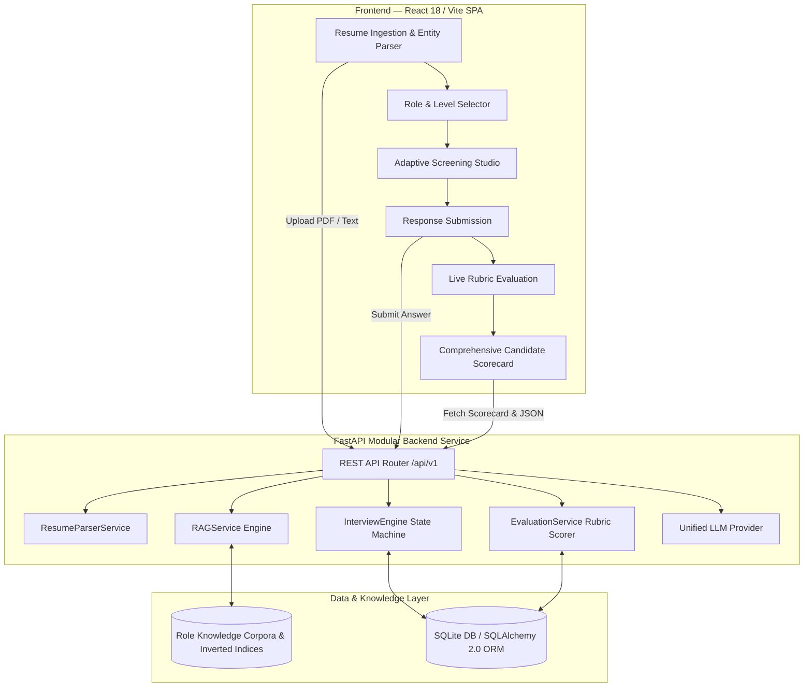

# VantageAI — Technical Candidate Screening Engine

[](https://fastapi.tiangolo.com)
[](https://reactjs.org)
[](https://python.org)
[](https://vitejs.dev)
[](https://docs.pytest.org)

An intelligent, multi-turn technical screening platform that dynamically conducts grounded technical assessments. The engine synthesizes questions by intersecting candidate resume profiles, selected technical roles, and role-specific foundational textbook literature using a Retrieval-Augmented Generation (RAG) pipeline.

---

## 1. System Architecture



### Core Components:
1. **Resume Processing Layer (`ResumeParserService`)**: Multi-format PDF and plaintext parser utilizing heuristic regex extraction for candidate metadata and a 60+ technical entity canonical taxonomy.
2. **Knowledge Base & Grounding Layer (`RAGService`)**: Ingests authoritative textbooks partitioned across 4 technical disciplines. Implements header-aware semantic chunking ($450$ words, $80$-word overlap) and an inverted TF-IDF term matrix with cosine similarity lookup.
3. **Screening State Machine (`InterviewEngine`)**: Orchestrates the multi-turn session lifecycle (`in_progress` $\to$ `completed`), formulating queries that combine candidate skills with textbook context to generate grounded questions and ideal rubrics.
4. **Grading & Reporting Engine (`EvaluationService`)**: Computes 4-dimensional rubric scores (**Technical Accuracy**, **Conceptual Depth**, **Practical Application**, **Clarity**), aggregates topic proficiencies, and generates exportable candidate scorecards.
5. **Multi-Provider LLM Abstraction (`LLMProvider`)**: Supports Google Gemini, OpenAI, and a high-fidelity deterministic fallback evaluator with strict 4-second network timeouts.

---

## 2. Setup & Installation Instructions

### Prerequisites
- **Python**: 3.10+ (tested on Python 3.12)
- **Node.js**: 18+ (tested on Node v20/v26)
- **Git**

---

### Backend Setup

1. **Navigate to the backend directory and set up a virtual environment:**
   ```bash
   cd backend
   python3 -m venv venv
   source venv/bin/activate
   ```

2. **Install Python dependencies:**
   ```bash
   pip install -r requirements.txt
   ```

3. **(Optional) Configure Environment Variables:**
   ```bash
   cp .env.example .env
   ```
   *Note: If no API keys are configured, the system automatically uses its built-in deterministic heuristic evaluator for zero-configuration testing.*

4. **Seed the RAG Knowledge Base:**
   ```bash
   python seed_knowledge_base.py
   ```
   *Indexes 42 semantic textbook chunks across all 4 role domains.*

5. **Start the FastAPI Development Server:**
   ```bash
   uvicorn app.main:app --host 0.0.0.0 --port 8000 --reload
   ```
   *API will be available at `http://localhost:8000`. Interactive Swagger documentation is accessible at `http://localhost:8000/docs`.*

---

### Frontend Setup

1. **Navigate to the frontend directory:**
   ```bash
   cd frontend
   ```

2. **Install Node packages:**
   ```bash
   npm install --strict-ssl=false
   ```

3. **Start the Vite development server:**
   ```bash
   npm run dev
   ```
   *Frontend interface will be running at `http://localhost:5173`.*

---

### Running Automated Test Suite

Run the full backend test suite with verbose output:
```bash
PYTHONPATH=backend ./backend/venv/bin/pytest backend/tests -v
```
**Expected Outcome:** 17/17 tests passing across resume parsing, RAG retrieval, interview engine state machine, evaluation rubrics, and API endpoints.

---

## 3. Key Design Decisions & Technical Trade-Offs

### 1. Inverted TF-IDF Matrix vs. Heavy Dense Vector Databases
* **Decision**: Implemented an in-memory inverted index with TF-IDF vectorization and cosine similarity scoring for the textbook RAG pipeline.
* **Rationale**:
  - **Latency & Reliability**: Operates completely in-memory with sub-millisecond retrieval times, avoiding external API network round-trips and rate limits.
  - **Keyword Precision**: Crucial algorithmic concepts (`SplitInformation`, `C4.5`, `SAGA`, `AdamW`, `KS-Test`) have distinct mathematical terms that dense vectors can dilute in high-dimensional embedding spaces.
  - **Decoupled Interface**: The `RAGService` retrieval contract is fully modularized, enabling seamless migration to `pgvector` or `Qdrant` if scaling to millions of documents.

### 2. Header-Aware Semantic Chunking with Sliding Window Overlap
* **Decision**: Replaced naive fixed-character chunking with a two-tier strategy: splitting first on markdown semantic boundaries (`# Chapter`, `## Section`) followed by a sliding window of $450$ words with an $80$-word overlap.
* **Rationale**: Prevents formulas, derivations, and algorithmic explanations from being truncated across chunk boundaries while preserving source book and chapter metadata for auditability.

### 3. Ground-Truth Rubric Anchoring for Objective Evaluation
* **Decision**: Simultaneously generate an "Ideal Answer Rubric" at question creation time and store it with the question record in the database.
* **Rationale**: Evaluates candidate answers strictly against the stored textbook rubric across 4 explicit criteria (Accuracy, Depth, Practicality, Clarity) rather than free-form LLM judgment, eliminating evaluation drift and hallucinations.

### 4. Resilient Multi-Tier Provider Layer with Strict Timeouts
* **Decision**: Structured the LLM integration layer to enforce strict 4.0-second request timeouts on external providers (Gemini/OpenAI) with automatic fallback to an intelligent deterministic heuristic evaluator.
* **Rationale**: Ensures the screening platform is 100% testable offline, eliminates UI freezing caused by network latency, and guarantees sub-second responsiveness under all network conditions.

---

## 4. API Specification Summary

| Method | Endpoint | Description |
| :--- | :--- | :--- |
| `POST` | `/api/v1/resume/upload` | Upload and parse candidate resume (PDF or TXT). |
| `POST` | `/api/v1/resume/parse-text` | Parse raw text resume payload with entity extraction. |
| `POST` | `/api/v1/interview/start` | Initialize an adaptive multi-turn screening session. |
| `POST` | `/api/v1/interview/{id}/submit-answer` | Submit candidate response, compute rubric score, and advance question. |
| `GET` | `/api/v1/evaluation/{id}/report` | Retrieve comprehensive candidate scorecard and category analytics. |
| `GET` | `/api/v1/evaluation/{id}/export-json` | Export full interview audit trail as structured JSON. |
| `GET` | `/api/v1/rag/roles` | List all supported engineering roles and indexed textbooks. |
| `POST` | `/api/v1/rag/query` | Inspect top-$K$ retrieved textbook chunks for a given query. |

---

## 5. Knowledge Base Literature Mapping

| Target Role | Grounding Textbook Corpora | Primary Topic Coverage |
| :--- | :--- | :--- |
| **AI / Machine Learning Engineer** | *Machine Learning* (Tom Mitchell)<br>*The Hundred-Page Machine Learning Book* (Andriy Burkov) | Entropy, Information Gain, Backpropagation, Sigmoid vs. ReLU, L1/L2 Regularization, SVM Kernels, Bellman Optimality. |
| **Data Science / Applied ML** | *Master Machine Learning Algorithms* (Jason Brownlee)<br>*Applied Python Workflows* | Pipeline Data Leakage, SMOTE & Class Imbalance, GBDT vs Random Forest, Model Drift (PSI/KS-test), Odds Ratios. |
| **Backend & Distributed Systems** | *High-Scale Distributed Systems Architecture*<br>*API Architecture, Concurrency & Security Engineering* | Cache-Aside Pattern, Mutex Locks, AsyncIO Concurrency, Sharding & Consistent Hashing, SAGA Pattern, Token Bucket Rate Limiting. |
| **Theoretical ML & Foundations** | *Pattern Recognition and Machine Learning* (Christopher Bishop)<br>*Deep Learning Theory & Transformer Architecture* | Bayesian Conjugacy, EM Algorithm Intractability, Scaled Dot-Product Attention, PCA Eigen-Derivations, AdamW Weight Decay. |

---

*For detailed interview defense notes and talking points, refer to [`INTERVIEW_PREP_GUIDE.md`](INTERVIEW_PREP_GUIDE.md). For testing workflows, refer to [`TESTING_GUIDE.md`](TESTING_GUIDE.md).*
